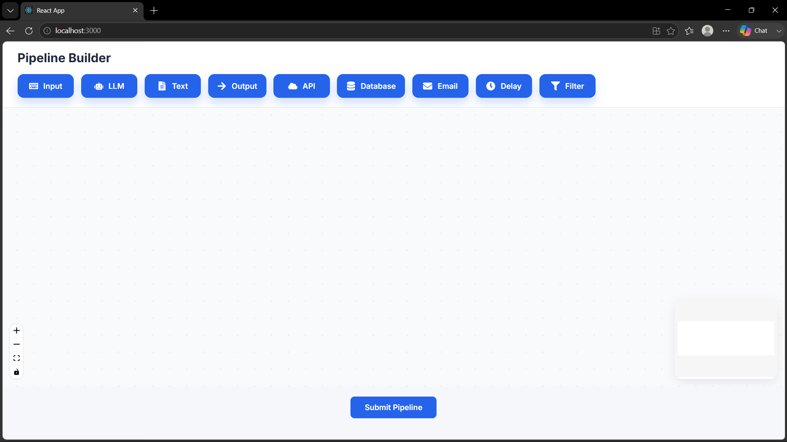
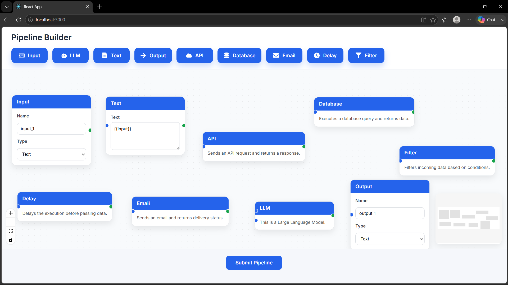
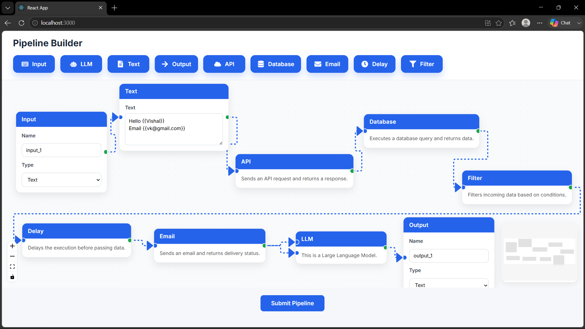
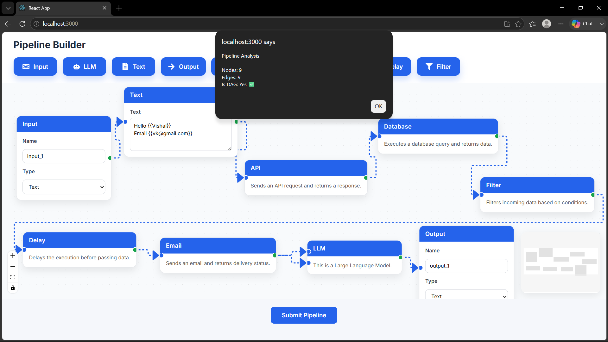

# 🚀 VectorShift Frontend Technical Assessment

A visual pipeline builder developed as part of the VectorShift Frontend Technical Assessment.

The application allows users to create pipelines by dragging and connecting nodes, supports dynamic text variables, and integrates with a FastAPI backend to validate the pipeline by counting nodes, counting edges, and determining whether the graph is a Directed Acyclic Graph (DAG).

---

## 📸 Project Preview

> **Add your screenshots here after uploading them to GitHub.**

Example:

```
assets/
├── home.png
├── pipeline.png
├── text-node.png
└── result.png
```

Then use:

```md







```

---

# ✨ Features

- 🎯 Drag & Drop pipeline builder
- 🔗 Connect nodes using React Flow
- ♻️ Reusable BaseNode component
- 🎨 Modern responsive UI
- 📝 Dynamic Text Node
- 📏 Automatic width & height adjustment
- 🔄 Dynamic variable detection using `{{variable}}`
- ⚡ Automatically generated input handles
- 📊 Backend integration with FastAPI
- 📈 Counts nodes and edges
- ✅ Detects whether the pipeline is a DAG

---

# 🧩 Available Nodes

The application currently includes:

- Input Node
- Output Node
- Text Node
- LLM Node
- API Node
- Database Node
- Email Node
- Delay Node
- Filter Node

Each node is built using a reusable `BaseNode` component, making it easy to extend the pipeline with additional node types.

---

# 🏗️ Node Abstraction

Instead of creating every node from scratch, a reusable `BaseNode` component was implemented.

This abstraction provides:

- Common styling
- Input/Output handles
- Reusable layout
- Custom content through children
- Configurable handles

This significantly reduces duplicate code and makes adding new nodes simple.

---

# 📝 Dynamic Text Node

The Text Node supports:

- Automatic height adjustment
- Automatic width adjustment
- Variable detection using:

```text
{{name}}

{{email}}

{{city}}
```

Every detected variable automatically creates a new input handle.

---

# ⚙️ Backend Integration

The frontend communicates with a FastAPI backend.

When the **Submit** button is clicked, it sends:

- Nodes
- Edges

The backend then returns:

- Number of Nodes
- Number of Edges
- Whether the graph is a Directed Acyclic Graph (DAG)

---

# 🛠️ Tech Stack

### Frontend

- React.js
- React Flow
- Zustand
- JavaScript
- CSS
- React Icons

### Backend

- FastAPI
- Python
- Pydantic

---

# 📂 Project Structure

```
frontend/
│
├── src/
│   ├── nodes/
│   │   ├── BaseNode.js
│   │   ├── InputNode.js
│   │   ├── OutputNode.js
│   │   ├── TextNode.js
│   │   ├── LLMNode.js
│   │   ├── ApiNode.js
│   │   ├── DatabaseNode.js
│   │   ├── DelayNode.js
│   │   └── FilterNode.js
│   │
│   ├── toolbar.js
│   ├── draggableNode.js
│   ├── ui.js
│   ├── store.js
│   ├── submit.js
│   └── utils/
│       └── textParser.js
│
backend/
│
└── main.py
```

---

# 🚀 Installation

## Clone the repository

```bash
git clone <repository-url>
```

---

## Frontend

```bash
cd frontend

npm install

npm start
```

Runs on:

```
http://localhost:3000
```

---

## Backend

```bash
cd backend

pip install fastapi uvicorn pydantic python-multipart

uvicorn main:app --reload
```

Runs on:

```
http://127.0.0.1:8000
```

---

# 🧪 Build

```bash
npm run build
```

The project compiles successfully for production.

---

# 📌 Future Improvements

- Better pipeline validation
- Node configuration panels
- Save & Load pipelines
- Export/Import pipeline JSON
- Toast notifications instead of alerts

---

# 👨‍💻 Author

**Vishal Prajapati**

- GitHub: https://github.com/Vishalprajapati-dev
- LinkedIn: https://www.linkedin.com/in/vishal-prajapati-0b08b2224

---

## 📄 License

This project was created as part of the **VectorShift Frontend Technical Assessment** for educational and evaluation purposes.